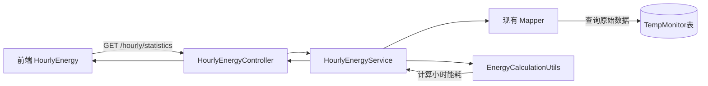

# Design Document - Hourly Energy Backend API

## Overview

日能耗统计后端 API 提供指定日期（年-月-日）的24小时能耗数据查询功能，时间范围从当天 07:00 到次日 07:00。本设计采用与月度能耗统计相同的三层架构模式，最大化复用现有组件和工具类，保持代码简洁。

## Steering Document Alignment

### Technical Standards
- **三层架构**：Controller-Service-Mapper 分层设计
- **代码复用**：复用 `EnergyCalculationUtils` 工具类和现有 Mapper
- **统一响应格式**：使用 `BaseResponse<T>` 封装返回数据
- **日志规范**：使用 Lombok `@Slf4j` 和统一的日志格式

### Project Structure
- **Controller**: `com.yupi.springbootinit.controller.HourlyEnergyController`
- **Service**: `com.yupi.springbootinit.service.HourlyEnergyService`
- **ServiceImpl**: `com.yupi.springbootinit.service.impl.HourlyEnergyServiceImpl`
- **DTO**: `com.yupi.springbootinit.model.dto.tempmonitor.HourlyEnergyStatistics`
- **Mapper**: 复用现有的车间 Mapper（如 `AirConditioningMapper`）

## Code Reuse Analysis

### 核心复用组件
- ✅ **EnergyCalculationUtils.calculateHourlyEnergyFromRawData**: 核心小时能耗计算逻辑
- ✅ **现有车间 Mapper**: 复用 `selectHourlyRawData` 方法查询原始数据
- ✅ **BaseResponse**: 统一的 API 响应封装
- ✅ **ResultUtils**: 响应结果构建工具类
- ✅ **TempMonitor**: 现有的数据模型

### Integration Points
- **数据库**: 使用与月度统计相同的 TempMonitor 表
- **工具类**: 完全复用 EnergyCalculationUtils 的计算逻辑
- **前端对接**: 返回数据结构与 HourlyEnergy 组件完全匹配

## Architecture

采用简洁的三层架构，最小化代码复杂度：



### 设计原则
- **单一职责**: 每个类只负责一个明确的功能
- **复用优先**: 优先使用现有工具类，不重复造轮子
- **代码简洁**: Service 层保持简洁，主要负责数据查询和组装

## Components and Interfaces

### Component 1: HourlyEnergyController
- **Purpose**: 接收前端请求，参数验证，返回响应
- **Path**: `/hourly/statistics`
- **Method**: GET
- **Parameters**: 
  - `year`: Integer (必需)
  - `month`: Integer (必需，1-12)
  - `day`: Integer (必需，1-31)
- **Response**: `BaseResponse<HourlyEnergyStatistics>`
- **Reuses**: BaseResponse, ResultUtils

**接口示例**:
```java
@GetMapping("/statistics")
public BaseResponse<HourlyEnergyStatistics> getHourlyStatistics(
    @RequestParam Integer year,
    @RequestParam Integer month,
    @RequestParam Integer day)
```

### Component 2: HourlyEnergyService
- **Purpose**: 业务逻辑层接口
- **Method**: `getHourlyStatistics(Integer year, Integer month, Integer day)`
- **Return**: `HourlyEnergyStatistics`
- **Reuses**: 无（接口定义）

### Component 3: HourlyEnergyServiceImpl
- **Purpose**: 实现小时能耗统计业务逻辑
- **核心流程**:
  1. 计算查询时间范围（当天07:00 到次日08:00）
  2. 查询所有车间的原始数据
  3. 按车间分组，调用 `EnergyCalculationUtils` 计算每个车间的24小时能耗
  4. 汇总生成 `hourlyTotal`
  5. 组装返回数据
- **Reuses**: 
  - `EnergyCalculationUtils.calculateHourlyEnergyFromRawData`
  - 现有车间 Mapper 的 `selectHourlyRawData` 方法
- **Dependencies**: 
  - 各车间 Mapper（或创建统一的查询接口）
  - EnergyCalculationUtils

**核心代码逻辑**（伪代码）:
```java
public HourlyEnergyStatistics getHourlyStatistics(Integer year, Integer month, Integer day) {
    // 1. 计算时间范围
    Date startTime = 当天07:00;
    Date endTime = 次日08:00;
    
    // 2. 查询所有车间原始数据（简化：可以从某个统一的Mapper查询）
    List<TempMonitor> allRawData = mapper.selectAllWorkshopsData(startTime, endTime);
    
    // 3. 按车间分组
    Map<String, List<TempMonitor>> workshopDataMap = allRawData.stream()
        .collect(Collectors.groupingBy(TempMonitor::getName));
    
    // 4. 为每个车间计算24小时能耗（复用工具类）
    Map<String, List<Double>> workshopHourlyData = new LinkedHashMap<>();
    for (String workshop : workshopDataMap.keySet()) {
        List<HourlyEnergyConsumption> hourlyData = 
            EnergyCalculationUtils.calculateHourlyEnergyFromRawData(
                workshopDataMap.get(workshop), startTime, endTime, workshop);
        workshopHourlyData.put(workshop, extractEnergyValues(hourlyData));
    }
    
    // 5. 计算 hourlyTotal（所有车间求和）
    List<Double> hourlyTotal = calculateHourlyTotal(workshopHourlyData);
    
    // 6. 组装返回数据
    return buildStatistics(year, month, day, workshopList, workshopHourlyData, hourlyTotal);
}
```

### Component 4: HourlyEnergyStatistics (DTO)
- **Purpose**: 封装小时能耗统计数据
- **Fields**:
  - `year`: Integer - 查询年份
  - `month`: Integer - 查询月份
  - `day`: Integer - 查询日期
  - `workshopList`: List<String> - 车间名称列表（排序）
  - `workshopHourlyData`: Map<String, List<Double>> - 各车间24小时数据
  - `hourlyTotal`: List<Double> - 每小时总能耗（24个元素）
- **Reuses**: Lombok (@Data注解)

## Data Models

### HourlyEnergyStatistics
```java
@Data
public class HourlyEnergyStatistics implements Serializable {
    /**
     * 查询年份
     */
    private Integer year;
    
    /**
     * 查询月份 (1-12)
     */
    private Integer month;
    
    /**
     * 查询日期 (1-31)
     */
    private Integer day;
    
    /**
     * 车间列表（动态获取，按名称排序）
     */
    private List<String> workshopList;
    
    /**
     * 各车间的24小时能耗数据
     * key: 车间名称, value: 24个小时的能耗值（索引0=07:00-08:00, 索引23=次日06:00-07:00）
     */
    private Map<String, List<Double>> workshopHourlyData;
    
    /**
     * 每小时所有车间的总能耗（24个元素）
     */
    private List<Double> hourlyTotal;
    
    private static final long serialVersionUID = 1L;
}
```

### 复用现有模型
- **TempMonitor**: 数据库查询结果模型（已存在）
- **HourlyEnergyConsumption**: EnergyCalculationUtils 返回的中间模型（已存在）

## Mapper Layer Design

### 方案1: 创建统一查询 Mapper（推荐）
创建一个简单的 Mapper 接口，用于查询所有车间的数据：

```java
@Mapper
public interface HourlyEnergyMapper {
    /**
     * 查询所有车间在指定时间范围内的原始数据
     */
    List<TempMonitor> selectAllWorkshopsHourlyData(
        @Param("startTime") Date startTime,
        @Param("endTime") Date endTime
    );
}
```

**对应 XML**:
```xml
<select id="selectAllWorkshopsHourlyData" resultType="com.yupi.springbootinit.model.entity.TempMonitor">
    SELECT name, updateTime, electricEnergy
    FROM TempMonitor
    WHERE updateTime >= #{startTime}
      AND updateTime &lt;= #{endTime}
    ORDER BY name, updateTime
</select>
```

### 方案2: 复用现有 Mapper
如果现有的某个 Mapper（如 `AirConditioningMapper`）已有类似查询方法，可以直接复用。

## Error Handling

### Error Scenarios

1. **参数验证失败**
   - **Handling**: Controller 层参数校验，返回 400 错误
   - **User Impact**: 前端收到明确的参数错误提示
   - **Example**: "缺少必需参数: year" 或 "无效的日期: 2月30日"

2. **数据库查询失败**
   - **Handling**: try-catch 捕获异常，记录日志，返回 500 错误
   - **User Impact**: 前端收到"数据查询失败"提示
   - **Log**: ERROR 级别，包含完整异常堆栈

3. **无数据情况**
   - **Handling**: 返回成功响应，但 workshopList 为空，数据为零值
   - **User Impact**: 前端显示"暂无数据"
   - **Log**: INFO 级别，记录无数据情况

4. **数据异常（负值能耗等）**
   - **Handling**: Service 层检测异常数据，记录警告日志，数据置为 null 或 0
   - **User Impact**: 异常数据不显示或显示为 0
   - **Log**: WARN 级别，记录异常数据详情

## Logging Strategy

### 日志级别使用
- **INFO**: 
  - 请求接收: "📊 接收日能耗统计请求: {year}年{month}月{day}日"
  - 查询成功: "✅ 日能耗统计完成: {workshopCount}个车间"
  
- **DEBUG**: 
  - 详细计算过程（可选）
  
- **WARN**: 
  - 数据异常: "⚠️ 发现异常能耗数据: 车间={}, 小时={}, 值={}"
  - 无数据: "⚠️ 无能耗数据: {year}年{month}月{day}日"
  
- **ERROR**: 
  - 查询失败: "❌ 日能耗统计失败: {year}年{month}月{day}日", 附带异常堆栈

## Testing Strategy

### Unit Testing
- **HourlyEnergyServiceImpl**: 
  - 测试时间范围计算的正确性
  - 测试车间分组逻辑
  - 测试 hourlyTotal 求和逻辑
  - Mock Mapper 和 EnergyCalculationUtils

- **HourlyEnergyController**: 
  - 测试参数验证
  - 测试响应格式
  - Mock Service 层

### Integration Testing
- **完整流程测试**: 
  - 准备测试数据
  - 调用 API 接口
  - 验证返回数据的准确性
  - 验证数据一致性（各车间总和 = hourlyTotal）

### End-to-End Testing
- **前后端联调**: 
  - 使用前端 HourlyEnergy 组件请求真实 API
  - 验证数据展示的正确性
  - 验证跨天时间范围的处理

## Implementation Notes

### 关键实现要点

1. **时间范围计算**
   ```java
   // 当天 07:00
   Calendar cal = Calendar.getInstance();
   cal.set(year, month - 1, day, 7, 0, 0);
   cal.set(Calendar.MILLISECOND, 0);
   Date startTime = cal.getTime();
   
   // 次日 08:00（多查1小时）
   cal.add(Calendar.DAY_OF_MONTH, 1);
   cal.set(Calendar.HOUR_OF_DAY, 8);
   Date endTime = cal.getTime();
   ```

2. **复用工具类**
   ```java
   // 直接调用现有工具类，无需重复实现
   List<HourlyEnergyConsumption> result = 
       EnergyCalculationUtils.calculateHourlyEnergyFromRawData(
           rawData, startTime, endTime, workshopName);
   ```

3. **数据组装简化**
   ```java
   // 从 HourlyEnergyConsumption 提取能耗值
   List<Double> energyValues = result.stream()
       .map(HourlyEnergyConsumption::getEnergyConsumption)
       .map(v -> v == null ? 0.0 : v)
       .collect(Collectors.toList());
   ```

4. **保持代码简洁**
   - Service 层方法不超过 50 行
   - 提取小方法处理细节逻辑（如 `calculateHourlyTotal`）
   - 使用 Stream API 简化集合操作

## Performance Considerations

- **数据库查询**: 一次查询所有车间数据，避免多次查询
- **内存使用**: 对于大量车间，考虑分批处理（当前10个车间无需考虑）
- **缓存策略**: 可选，历史日期数据可缓存（暂不实现）

## API 完整示例

### Request
```
GET /hourly/statistics?year=2025&month=10&day=9
```

### Response
```json
{
  "code": 0,
  "data": {
    "year": 2025,
    "month": 10,
    "day": 9,
    "workshopList": ["1办公楼", "101铸科", "102造粒", ...],
    "workshopHourlyData": {
      "1办公楼": [95.7, 105.2, 112.8, ...],
      "101铸科": [42.6, 56.3, 67.8, ...],
      ...
    },
    "hourlyTotal": [878.6, 1113.8, 1344.9, ...]
  },
  "message": "ok"
}
```

## Summary

本设计通过最大化复用现有组件和工具类，保持代码简洁清晰：
- ✅ 复用 `EnergyCalculationUtils` 核心计算逻辑
- ✅ 复用现有 Mapper 查询方法或创建简单的统一查询
- ✅ Service 层保持简洁，主要负责数据查询和组装
- ✅ 遵循现有系统的架构模式和代码规范
- ✅ 与前端 HourlyEnergy 组件完美对接
