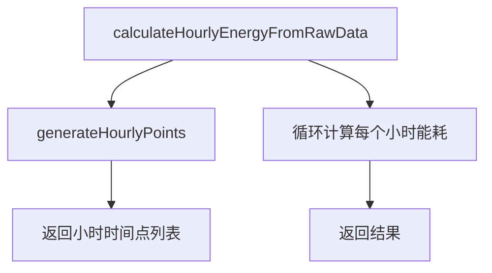

# Design Document

## Overview

本设计针对后端小时能耗计算的时间点生成逻辑进行微调。修改范围限定在 `EnergyCalculationUtils` 类的 `generateHourlyPoints` 私有方法，通过调整循环终止条件，使生成的小时时间点列表不包含用户输入的结束时间所在小时。

## Steering Document Alignment

### Technical Standards
- 遵循现有的工具类设计模式
- 保持代码简洁性和可读性
- 不破坏现有接口

### Project Structure
- 修改位于 `back2/src/main/java/com/yupi/springbootinit/utils/EnergyCalculationUtils.java`
- 不涉及其他文件的修改

## Code Reuse Analysis

### Existing Components to Leverage
- **EnergyCalculationUtils**: 现有的能耗计算工具类，包含完整的小时能耗计算逻辑
- **generateHourlyPoints**: 现有的私有方法，负责生成小时时间点列表

### Integration Points
- 无需新增集成点
- 修改后的方法继续被 `calculateHourlyEnergyFromRawData` 调用
- 返回值类型和结构保持不变

## Architecture

### 修改范围
只修改 `generateHourlyPoints` 方法的实现，该方法当前位于 `EnergyCalculationUtils` 类的第 268-284 行。



### 修改前后对比

**修改前的逻辑**：
```java
private static List<Date> generateHourlyPoints(Date startTime, Date endTime) {
    List<Date> hourlyPoints = new ArrayList<>();
    Calendar cal = Calendar.getInstance();
    cal.setTime(startTime);
    
    // 截取到小时开始
    cal.set(Calendar.MINUTE, 0);
    cal.set(Calendar.SECOND, 0);
    cal.set(Calendar.MILLISECOND, 0);
    
    while (cal.getTime().before(endTime)) {  // ← 这里是问题所在
        hourlyPoints.add(cal.getTime());
        cal.add(Calendar.HOUR_OF_DAY, 1);
    }
    
    return hourlyPoints;
}
```

**修改后的逻辑**：
```java
private static List<Date> generateHourlyPoints(Date startTime, Date endTime) {
    List<Date> hourlyPoints = new ArrayList<>();
    Calendar cal = Calendar.getInstance();
    cal.setTime(startTime);
    
    // 截取到小时开始
    cal.set(Calendar.MINUTE, 0);
    cal.set(Calendar.SECOND, 0);
    cal.set(Calendar.MILLISECOND, 0);
    
    // 将 endTime 也截取到小时开始，用于比较
    Calendar endCal = Calendar.getInstance();
    endCal.setTime(endTime);
    endCal.set(Calendar.MINUTE, 0);
    endCal.set(Calendar.SECOND, 0);
    endCal.set(Calendar.MILLISECOND, 0);
    Date endHour = endCal.getTime();
    
    while (cal.getTime().before(endHour)) {  // ← 改为与 endHour 比较
        hourlyPoints.add(cal.getTime());
        cal.add(Calendar.HOUR_OF_DAY, 1);
    }
    
    return hourlyPoints;
}
```

## Components and Interfaces

### EnergyCalculationUtils.generateHourlyPoints (私有方法)

- **Purpose:** 生成小时时间点列表，用于后续的能耗计算
- **Interfaces:** 
  - 输入：`Date startTime`, `Date endTime`
  - 输出：`List<Date>` 小时时间点列表
- **Dependencies:** 
  - Java Calendar API
- **修改点:** 
  - 新增：将 endTime 截取到小时开始
  - 修改：循环条件从 `cal.getTime().before(endTime)` 改为 `cal.getTime().before(endHour)`

### 影响范围
- **直接调用者**: `calculateHourlyEnergyFromRawData` 方法
- **间接影响**: 所有使用小时能耗计算的车间服务

## Data Models

无需修改数据模型，输入输出数据结构保持不变。

### 输入参数
```java
Date startTime;  // 示例：2024-01-01 08:00:00
Date endTime;    // 示例：2024-01-01 11:59:00
```

### 输出结果
```java
List<Date> hourlyPoints;  
// 修改前：[2024-01-01 08:00:00, 09:00:00, 10:00:00, 11:00:00]
// 修改后：[2024-01-01 08:00:00, 09:00:00, 10:00:00]
```

## Error Handling

### Error Scenarios

1. **Scenario: startTime > endTime**
   - **Handling:** 现有逻辑已处理，返回空列表
   - **User Impact:** 无变化

2. **Scenario: startTime == endTime**
   - **Handling:** 返回空列表
   - **User Impact:** 无变化

3. **Scenario: 时间跨度小于1小时**
   - **Handling:** 
     - 修改前：如果 startTime = 08:00, endTime = 08:30，会生成 [08:00]
     - 修改后：返回空列表（因为 08:00 不小于 08:00）
   - **User Impact:** 需要注意这个边界情况的变化

## Testing Strategy

### Unit Testing
- **测试方法**: `generateHourlyPoints`
- **测试用例**:
  1. 正常情况：08:00-11:59 应返回 [08:00, 09:00, 10:00]
  2. 整点情况：08:00-11:00 应返回 [08:00, 09:00, 10:00]
  3. 单小时：08:00-08:59 应返回空列表
  4. 跨天情况：23:00-次日02:00 应返回 [23:00, 00:00, 01:00]

### Integration Testing
- **测试场景**: 调用 `calculateHourlyEnergyFromRawData` 验证返回的记录数
- **验证点**:
  1. 08:00-11:59 应返回 3 条记录（而不是 4 条）
  2. 最后一条记录的 endTime 应该是基于 11:00 之后的数据

### End-to-End Testing
- **测试流程**: 前端传入 08:00-11:59，验证后端返回的数据条数和内容
- **预期结果**: 返回 3 条小时能耗记录

## Implementation Checklist

- [ ] 修改 `generateHourlyPoints` 方法
- [ ] 添加单元测试验证新逻辑
- [ ] 运行现有测试确保无回归
- [ ] 验证日志输出是否正确
