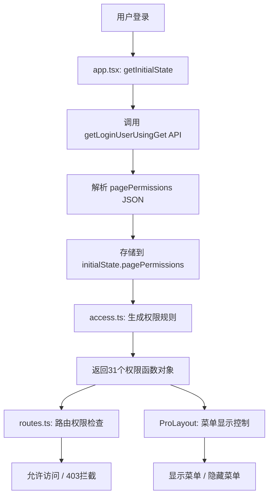

# Design Document - 前端权限控制系统

## Overview

本设计文档定义了 SolarBi 能耗管理平台前端权限控制系统的技术实现方案。该系统基于 Umi Max 框架的内置权限机制，通过解析用户的 `pagePermissions` 字段（JSON格式）实现30个页面的动态菜单显示和路由访问控制。

**注意**: UserManagement 页面已移至 `/admin` 目录下，由 `canAdmin` 控制，不在 `pagePermissions` 权限体系中。

**核心设计原则**：
- 所有用户（包括管理员）统一从后端 `pagePermissions` 字段获取权限
- 前端不根据 `userRole` 进行权限判断，仅作为权限配置的读取器
- 使用 Umi Max 的 `initialState` 和 `access` 机制实现权限控制
- 保持代码简洁，仅修改4个文件（app.tsx, access.ts, routes.ts, typings.d.ts）

## Steering Document Alignment

### Technical Standards

本设计遵循以下技术标准：
- **框架**: Umi Max 4.x (React 18)
- **UI库**: Ant Design Pro
- **类型系统**: TypeScript 4.x
- **权限机制**: Umi Max 内置的 `@umijs/max` access 插件
- **状态管理**: Umi Max `initialState` 全局状态
- **API 服务**: 复用现有的 `userController.ts`

### Project Structure

遵循项目现有结构：
```
front/
├── src/
│   ├── app.tsx                    # 修改：权限加载和解析
│   ├── access.ts                  # 修改：权限规则定义
│   ├── typings.d.ts               # 修改：类型定义
│   └── services/SolarBi-front/
│       └── userController.ts      # 复用：用户API服务
├── config/
│   └── routes.ts                  # 修改：路由权限配置
```

## Code Reuse Analysis

### Existing Components to Leverage

- **userController.ts**: 
  - 复用 `getLoginUserUsingGet()` API 获取用户信息
  - 该API已返回 `pagePermissions` 字段（JSON字符串）
  - 无需修改，直接使用

- **Umi Max 权限系统**:
  - 复用 `@umijs/max` 的 `access` 插件
  - 复用 `initialState` 机制存储全局权限状态
  - 复用 `access` 字段在路由配置中声明权限

- **现有类型定义**:
  - 扩展现有的 `API.LoginUserVO` 和 `API.User` 类型
  - 扩展 `InitialState` 类型定义

### Existing Components to Extend

- **app.tsx**:
  - 现有功能：调用 `getLoginUserUsingGet()` 获取用户信息
  - 新增功能：解析 `pagePermissions` JSON 字符串为对象
  - 新增功能：将解析后的权限存储到 `initialState.pagePermissions`

- **access.ts**:
  - 现有功能：返回 `canUser` 和 `canAdmin` 基础权限
  - 新增功能：为30个业务页面生成独立的权限函数
  - 移除逻辑：删除管理员自动授权逻辑

- **routes.ts**:
  - 现有功能：定义所有页面的路由配置
  - 修改功能：更新30个业务页面路由的 `access` 字段，指向新的权限函数
  - 保持不变：`/admin` 及其子路由继续使用 `canAdmin` 权限

### Integration Points

- **用户登录流程**: 在用户登录成功后，`app.tsx` 的 `getInitialState()` 自动触发权限加载
- **菜单渲染**: Ant Design Pro 的布局系统根据 `access` 自动隐藏无权限的菜单项
- **路由守卫**: Umi Max 的路由系统根据 `access` 自动拦截无权限的页面访问
- **后端数据**: 从 `user` 表的 `pagePermissions` 字段（TEXT类型，JSON格式）读取权限配置

### Backend Integration Requirements

由于 UserManagement 已移至 `/admin` 目录下并由 `canAdmin` 统一控制，后端需要相应调整：

**1. 数据库 pagePermissions 字段调整**:
- **移除字段**: 从 `pagePermissions` JSON 中移除 `"user-management"` key
- **保留30个业务页面权限**: 仅保留 `monthly-energy`、`hourly-energy`、`airConditioning` 等30个业务页面

**2. 默认权限配置调整**:

**管理员默认配置** (`userRole='admin'`):
```json
{
  "monthly-energy": true,
  "hourly-energy": true,
  "airConditioning": true,
  "injection_workshop": true,
  "granulation_workshop": true,
  "office_building": true,
  "feeding_workshop": true,
  "granule102": true,
  "cold-press-103": true,
  "restoration-104": true,
  "sintering-105": true,
  "cleaning-106": true,
  "beading-107": true,
  "rubber-109": true,
  "injection-110": true,
  "edging-111": true,
  "final-inspection-112": true,
  "warehouse-113": true,
  "elevator-114": true,
  "office-area-114": true,
  "conference-room-114": true,
  "laboratory-114": true,
  "public-114": true,
  "air-compressor-114": true,
  "charging-pile": true,
  "tool-rd-center": true,
  "guard-room": true,
  "canteen": true,
  "dormitory": true
}
```

**普通用户默认配置** (`userRole='user'`):
```json
{
  "monthly-energy": true,
  "hourly-energy": true,
  "airConditioning": false,
  "injection_workshop": false,
  "granulation_workshop": false,
  "office_building": false,
  "feeding_workshop": false,
  "granule102": false,
  "cold-press-103": false,
  "restoration-104": false,
  "sintering-105": false,
  "cleaning-106": false,
  "beading-107": false,
  "rubber-109": false,
  "injection-110": false,
  "edging-111": false,
  "final-inspection-112": false,
  "warehouse-113": false,
  "elevator-114": false,
  "office-area-114": false,
  "conference-room-114": false,
  "laboratory-114": false,
  "public-114": false,
  "air-compressor-114": false,
  "charging-pile": false,
  "tool-rd-center": false,
  "guard-room": false,
  "canteen": false,
  "dormitory": false
}
```

**3. 数据迁移 SQL 脚本**:

如果现有用户数据中包含 `"user-management"` 字段，需要清理：

```sql
-- 查看当前包含 user-management 的用户
SELECT id, userAccount, pagePermissions 
FROM user 
WHERE pagePermissions LIKE '%user-management%';

-- 手动清理方案：使用 JSON 函数移除 user-management 字段
-- 注意：以下 SQL 需根据实际数据库类型（MySQL/PostgreSQL/SQL Server）调整

-- MySQL 8.0+ 示例：
UPDATE user 
SET pagePermissions = JSON_REMOVE(pagePermissions, '$."user-management"')
WHERE JSON_CONTAINS_PATH(pagePermissions, 'one', '$."user-management"');

-- SQL Server 示例（需要手动解析和重建 JSON）：
-- 建议通过后端代码批量处理
```

**4. 后端代码调整位置**:

需要修改以下后端文件：
- `UserServiceImpl.java`: 更新 `userRegister()` 方法中的默认权限配置，移除 `user-management`
- 管理员创建逻辑：确保管理员的 `pagePermissions` 不包含 `user-management`
- 数据验证逻辑：如果有校验 `pagePermissions` 包含的 key，需移除 `user-management` 的校验

**5. API 响应示例**:

`GET /api/user/get/login` 返回的 `pagePermissions` 字段应该：
```json
{
  "code": 0,
  "data": {
    "id": 1,
    "userAccount": "admin",
    "userRole": "admin",
    "pagePermissions": "{\"monthly-energy\":true,\"hourly-energy\":true,\"airConditioning\":true,...}"
  }
}
```

**注意**: `pagePermissions` 字符串中不再包含 `"user-management"` key。

## Architecture

### 整体架构



### 权限控制流程

1. **登录阶段**:
   ```
   用户登录成功
   → getInitialState() 触发
   → 调用 /api/user/get/login
   → 获取 user.pagePermissions (JSON字符串)
   → JSON.parse() 解析为对象
   → 存储到 initialState.pagePermissions
   ```

2. **权限初始化**:
   ```
   access() 函数执行
   → 从 initialState 读取 pagePermissions
   → 为30个业务页面生成权限函数
   → 返回权限对象 { canAccessMonthlyEnergy: true/false, ... }
   ```

3. **菜单渲染**:
   ```
   ProLayout 渲染侧边栏
   → 遍历 routes 配置
   → 检查每个路由的 access 字段
   → 调用对应的权限函数
   → 根据返回值显示/隐藏菜单项
   ```

4. **路由访问**:
   ```
   用户访问页面 URL
   → Umi 路由守卫触发
   → 检查路由的 access 字段
   → 调用对应的权限函数
   → 允许访问 或 跳转403页面
   ```

### Modular Design Principles

- **单一职责**:
  - `app.tsx`: 仅负责权限数据加载和解析
  - `access.ts`: 仅负责权限规则定义
  - `routes.ts`: 仅负责路由配置
  - `typings.d.ts`: 仅负责类型定义

- **模块化**:
  - 权限逻辑与业务逻辑完全分离
  - 权限配置集中在 `access.ts` 一个文件中
  - 路由配置不包含权限判断逻辑

- **可扩展性**:
  - 新增业务页面权限仅需修改3个位置（access.ts, routes.ts, typings.d.ts可选）
  - 权限标识符与后端数据库保持一致，易于维护
  - 管理页面（/admin及其子页面）由 `canAdmin` 统一控制，无需配置 pagePermissions

## Components and Interfaces

### Component 1: app.tsx - 权限加载器

**Purpose**: 在用户登录时加载并解析页面权限

**修改内容**:
```typescript
// front/src/app.tsx
export async function getInitialState(): Promise<InitialState> {
  const initialState: InitialState = {
    currentUser: undefined,
    pagePermissions: {}, // 新增：存储解析后的权限
  };
  
  const { location } = history;
  if (location.pathname !== loginPath) {
    try {
      const res = await getLoginUserUsingGet();
      initialState.currentUser = res.data;
      
      // 🔑 新增：解析 pagePermissions JSON
      if (res.data?.pagePermissions) {
        try {
          const permissions = JSON.parse(res.data.pagePermissions);
          initialState.pagePermissions = permissions;
          console.log('✅ 权限加载成功:', permissions);
        } catch (error) {
          console.error('❌ 解析权限JSON失败，用户权限配置异常:', error);
          // 权限解析失败，跳转到404页面
          history.push('/404');
          return initialState;
        }
      } else {
        // 权限字段为空，跳转到404页面
        console.error('❌ 用户权限字段为空');
        history.push('/404');
        return initialState;
      }
    } catch (error: any) {
      history.push(`${loginPath}?redirect=${encodeURIComponent(location.pathname)}`);
    }
  }
  return initialState;
}
```

**Dependencies**:
- `getLoginUserUsingGet` from `@/services/SolarBi-front/userController`
- `history` from `@umijs/max`

**Reuses**:
- 现有的用户登录流程
- 现有的错误处理逻辑

---

### Component 2: access.ts - 权限规则定义

**Purpose**: 根据 `pagePermissions` 生成30个业务页面的权限判断函数

**完整实现**:
```typescript
// front/src/access.ts
/**
 * 权限控制
 * 所有用户（包括管理员）统一从 pagePermissions 获取权限
 */
export default function access(initialState: InitialState | undefined) {
  const { currentUser, pagePermissions = {} } = initialState ?? {};
  
  if (!currentUser) {
    return {
      canUser: false,
      canAdmin: false,
    };
  }

  // 判断是否为管理员（仅用于 /admin 路由的访问控制）
  const isAdmin = currentUser.userRole === 'admin';

  // 返回权限对象
  return {
    // 基础权限
    canUser: !!currentUser,
    canAdmin: isAdmin,

    // 🔑 30个业务页面的动态权限（统一从 pagePermissions 读取）
    canAccessMonthlyEnergy: pagePermissions['monthly-energy'] === true,
    canAccessHourlyEnergy: pagePermissions['hourly-energy'] === true,
    canAccessAirConditioning: pagePermissions['airConditioning'] === true,
    canAccessInjectionWorkshop: pagePermissions['injection_workshop'] === true,
    canAccessGranulationWorkshop: pagePermissions['granulation_workshop'] === true,
    canAccessOfficeBuilding: pagePermissions['office_building'] === true,
    canAccessFeedingWorkshop: pagePermissions['feeding_workshop'] === true,
    canAccessGranule102: pagePermissions['granule102'] === true,
    canAccessColdPress103: pagePermissions['cold-press-103'] === true,
    canAccessRestoration104: pagePermissions['restoration-104'] === true,
    canAccessSintering105: pagePermissions['sintering-105'] === true,
    canAccessCleaning106: pagePermissions['cleaning-106'] === true,
    canAccessBeading107: pagePermissions['beading-107'] === true,
    canAccessRubber109: pagePermissions['rubber-109'] === true,
    canAccessInjection110: pagePermissions['injection-110'] === true,
    canAccessEdging111: pagePermissions['edging-111'] === true,
    canAccessFinalInspection112: pagePermissions['final-inspection-112'] === true,
    canAccessWarehouse113: pagePermissions['warehouse-113'] === true,
    canAccessElevator114: pagePermissions['elevator-114'] === true,
    canAccessOfficeArea114: pagePermissions['office-area-114'] === true,
    canAccessConferenceRoom114: pagePermissions['conference-room-114'] === true,
    canAccessLaboratory114: pagePermissions['laboratory-114'] === true,
    canAccessPublic114: pagePermissions['public-114'] === true,
    canAccessAirCompressor114: pagePermissions['air-compressor-114'] === true,
    canAccessChargingPile: pagePermissions['charging-pile'] === true,
    canAccessToolRDCenter: pagePermissions['tool-rd-center'] === true,
    canAccessGuardRoom: pagePermissions['guard-room'] === true,
    canAccessCanteen: pagePermissions['canteen'] === true,
    canAccessDormitory: pagePermissions['dormitory'] === true,
  };
}
```

**Key Design Decisions**:
- ✅ **移除管理员特权逻辑**: 不使用 `isAdmin || pagePermissions[key]` 模式
- ✅ **统一权限来源**: 所有业务页面都从 `pagePermissions` 对象读取权限
- ✅ **保留 canAdmin**: 用于 `/admin` 管理页及其子页面（包括UserManagement）的访问控制
- ✅ **显式布尔判断**: 使用 `=== true` 确保只有明确的 `true` 才授予权限
- ✅ **管理页独立**: `/admin` 下的所有页面（User、UserManagement）统一由 `canAdmin` 控制，不需要配置 pagePermissions

**Dependencies**:
- `InitialState` 类型定义

**Reuses**:
- 现有的 `canUser` 和 `canAdmin` 基础权限（保持向后兼容）

---

### Component 3: routes.ts - 路由权限配置

**Purpose**: 为30个业务页面路由配置对应的权限标识

**修改策略**:
- 将现有的 `access: 'canUser'` 替换为具体的权限函数名
- 每个路由对应一个独立的权限函数

**示例修改（部分路由）**:
```typescript
// front/config/routes.ts
export default [
  // ... 登录路由保持不变 ...
  
  {
    path: '/monthly-energy',
    name: '月度能耗统计',
    icon: 'BarChartOutlined',
    component: './MonthlyEnergy',
    access: 'canAccessMonthlyEnergy', // 修改
  },
  {
    path: '/hourly-energy',
    name: '日能耗统计',
    icon: 'LineChartOutlined',
    component: './HourlyEnergy',
    access: 'canAccessHourlyEnergy', // 修改
  },
  // UserManagement 已移至 /admin 子路由下
  // 见下方 /admin 路由配置
  {
    path: '/airConditioning',
    name: '114_空调水机主机',
    icon: 'WalletFilled',
    component: './AirConditioning',
    access: 'canAccessAirConditioning', // 修改
  },
  // ... 其余28个路由类似修改 ...
  
  {
    path: '/admin',
    icon: 'crown',
    name: '管理页',
    access: 'canAdmin', // 控制整个管理页区域（包括所有子页面）
    routes: [
      { path: '', redirect: 'user-management' },
      { icon: 'table', path: 'user', component: './Admin/User', name: '用户列表' },
      { icon: 'UserOutlined', path: 'user-management', component: './Admin/UserManagement', name: '用户管理系统' }, // 继承父路由的 canAdmin 权限
    ],
  },
  { path: '/', redirect: '/monthly-energy'},
  { path: '*', layout: false, component: './404' },
];
```

**完整映射表**（权限Key → 路由Path → Access函数）:

**说明**: 
- 以下30个业务页面通过 `pagePermissions` 控制访问权限
- `/admin` 及其子页面（User、UserManagement）由 `canAdmin` 统一控制，不在此映射表中

| 数据库Key | 路由Path | Access函数名 |
|-----------|----------|--------------|
| `monthly-energy` | `/monthly-energy` | `canAccessMonthlyEnergy` |
| `hourly-energy` | `/hourly-energy` | `canAccessHourlyEnergy` |
| `airConditioning` | `/airConditioning` | `canAccessAirConditioning` |
| `injection_workshop` | `/injection_workshop` | `canAccessInjectionWorkshop` |
| `granulation_workshop` | `/granulation_workshop` | `canAccessGranulationWorkshop` |
| `office_building` | `/office_building` | `canAccessOfficeBuilding` |
| `feeding_workshop` | `/feeding_workshop` | `canAccessFeedingWorkshop` |
| `granule102` | `/granule102` | `canAccessGranule102` |
| `cold-press-103` | `/cold-press-103` | `canAccessColdPress103` |
| `restoration-104` | `/restoration-104` | `canAccessRestoration104` |
| `sintering-105` | `/sintering-105` | `canAccessSintering105` |
| `cleaning-106` | `/cleaning-106` | `canAccessCleaning106` |
| `beading-107` | `/beading-107` | `canAccessBeading107` |
| `rubber-109` | `/rubber-109` | `canAccessRubber109` |
| `injection-110` | `/injection-110` | `canAccessInjection110` |
| `edging-111` | `/edging-111` | `canAccessEdging111` |
| `final-inspection-112` | `/final-inspection-112` | `canAccessFinalInspection112` |
| `warehouse-113` | `/warehouse-113` | `canAccessWarehouse113` |
| `elevator-114` | `/elevator-114` | `canAccessElevator114` |
| `office-area-114` | `/office-area-114` | `canAccessOfficeArea114` |
| `conference-room-114` | `/conference-room-114` | `canAccessConferenceRoom114` |
| `laboratory-114` | `/laboratory-114` | `canAccessLaboratory114` |
| `public-114` | `/public-114` | `canAccessPublic114` |
| `air-compressor-114` | `/air-compressor-114` | `canAccessAirCompressor114` |
| `charging-pile` | `/charging-pile` | `canAccessChargingPile` |
| `tool-rd-center` | `/tool-rd-center` | `canAccessToolRDCenter` |
| `guard-room` | `/guard-room` | `canAccessGuardRoom` |
| `canteen` | `/canteen` | `canAccessCanteen` |
| `dormitory` | `/dormitory` | `canAccessDormitory` |

**Dependencies**:
- `access.ts` 中定义的权限函数

**Reuses**:
- 现有的路由结构和组件路径

**特殊说明 - UserManagement 子路由权限控制**:

UserManagement 页面已移至 `/admin` 目录下，实际路由为 `/admin/user-management`。

**权限控制策略**:
- `/admin` 父路由及其所有子路由（User、UserManagement）**统一由 `canAdmin` 控制**
- 不需要在 `pagePermissions` 中配置 `user-management` 权限
- 这是一个**管理员专属区域**，所有管理功能集中在此

**权限验证逻辑**:
```
用户访问 /admin/user-management
→ 验证 canAdmin（userRole === 'admin'）
→ 验证通过即可访问（无需额外的 pagePermissions 检查）
```

**用户访问规则**:
- **管理员** (`userRole='admin'`): 可访问 `/admin` 下的所有页面
- **普通用户**: 无法访问 `/admin` 区域，无论 `pagePermissions` 如何配置

**菜单显示逻辑**:
- `/admin` 父菜单及其所有子菜单：仅当 `canAdmin=true` 时显示

这种设计确保了：
- ✅ 管理功能与业务功能清晰分离
- ✅ 管理员拥有完整的管理权限，无需繁琐配置
- ✅ 普通用户完全无法接触管理功能

---

### Component 4: typings.d.ts - 类型定义

**Purpose**: 为权限系统提供完整的 TypeScript 类型支持

**新增/修改类型**:
```typescript
// front/src/typings.d.ts

// 定义 InitialState 类型
interface InitialState {
  currentUser?: API.LoginUserVO | API.User;
  pagePermissions?: Record<string, boolean>; // 新增：页面权限对象
}

// 扩展 User 和 LoginUserVO 类型
declare namespace API {
  interface User {
    id?: number;
    userAccount?: string;
    userPassword?: string;
    userName?: string;
    userAvatar?: string;
    userRole?: string;
    userStatus?: string;
    lastLoginTime?: string;
    pagePermissions?: string; // 新增：JSON字符串类型
    createTime?: string;
    updateTime?: string;
    isDelete?: number;
  }

  interface LoginUserVO {
    id?: number;
    userAccount?: string;
    userName?: string;
    userAvatar?: string;
    userRole?: string;
    userStatus?: string;
    lastLoginTime?: string;
    pagePermissions?: string; // 新增：JSON字符串类型
    createTime?: string;
  }
}
```

**Dependencies**: 无

**Reuses**: 
- 现有的 API 命名空间
- 现有的类型定义模式

## Data Models

### PagePermissions Object

**结构** (存储在 `initialState.pagePermissions`):
```typescript
{
  "monthly-energy": boolean,
  "hourly-energy": boolean,
  "airConditioning": boolean,
  "injection_workshop": boolean,
  "granulation_workshop": boolean,
  "office_building": boolean,
  "feeding_workshop": boolean,
  "granule102": boolean,
  "cold-press-103": boolean,
  "restoration-104": boolean,
  "sintering-105": boolean,
  "cleaning-106": boolean,
  "beading-107": boolean,
  "rubber-109": boolean,
  "injection-110": boolean,
  "edging-111": boolean,
  "final-inspection-112": boolean,
  "warehouse-113": boolean,
  "elevator-114": boolean,
  "office-area-114": boolean,
  "conference-room-114": boolean,
  "laboratory-114": boolean,
  "public-114": boolean,
  "air-compressor-114": boolean,
  "charging-pile": boolean,
  "tool-rd-center": boolean,
  "guard-room": boolean,
  "canteen": boolean,
  "dormitory": boolean
}
```

**数据来源**: 从 `user.pagePermissions` 字段（TEXT类型，存储JSON字符串）解析而来

**错误处理**: 如果解析失败或字段为空，跳转到404页面，不提供默认权限

### Access Object

**结构** (由 `access.ts` 返回):
```typescript
{
  canUser: boolean,
  canAdmin: boolean,
  canAccessMonthlyEnergy: boolean,
  canAccessHourlyEnergy: boolean,
  canAccessUserManagement: boolean,
  canAccessAirConditioning: boolean,
  // ... 其余27个权限函数
}
```

**使用场景**:
- 路由守卫：Umi 根据路由的 `access` 字段调用对应函数
- 菜单渲染：ProLayout 根据权限函数返回值显示/隐藏菜单
- 代码中：可通过 `useAccess()` Hook 获取权限对象

**注意**: `/admin` 及其子路由使用 `canAdmin` 权限，不在 `pagePermissions` 中配置

## Error Handling

### Error Scenario 1: JSON解析失败

**Description**: 用户的 `pagePermissions` 字段包含无效的JSON字符串

**Handling**:
```typescript
try {
  const permissions = JSON.parse(res.data.pagePermissions);
  initialState.pagePermissions = permissions;
  console.log('✅ 权限加载成功:', permissions);
} catch (error) {
  console.error('❌ 解析权限JSON失败，用户权限配置异常:', error);
  // 权限解析失败，跳转到404页面
  history.push('/404');
  return initialState;
}
```

**User Impact**: 用户被重定向到404页面，无法访问任何页面，提示权限配置异常

**Rationale**: 
- 权限配置异常属于严重的数据错误，不应允许用户访问系统
- 避免因默认权限配置不当导致安全风险
- 强制管理员修复用户的权限配置

---

### Error Scenario 2: 权限字段为空

**Description**: 用户的 `pagePermissions` 字段为 `null` 或 `undefined`

**Handling**:
```typescript
if (res.data?.pagePermissions) {
  // 解析权限
  try {
    const permissions = JSON.parse(res.data.pagePermissions);
    initialState.pagePermissions = permissions;
  } catch (error) {
    console.error('❌ 解析权限JSON失败:', error);
    history.push('/404');
    return initialState;
  }
} else {
  // 权限字段为空，跳转到404页面
  console.error('❌ 用户权限字段为空');
  history.push('/404');
  return initialState;
}
```

**User Impact**: 用户被重定向到404页面，无法访问任何页面，提示权限未配置

**Rationale**: 
- 未配置权限的用户不应被允许访问系统
- 强制管理员为新用户配置权限
- 保持权限管理的严格性

---

### Error Scenario 3: API调用失败

**Description**: `getLoginUserUsingGet()` 接口调用失败（网络错误、后端异常等）

**Handling**:
```typescript
try {
  const res = await getLoginUserUsingGet();
  // ...
} catch (error: any) {
  // 重定向到登录页面
  const redirectUrl = `${loginPath}?redirect=${encodeURIComponent(location.pathname)}`;
  history.push(redirectUrl);
}
```

**User Impact**: 用户被重定向到登录页面，原始页面路径保存在 URL 参数中

---

### Error Scenario 4: 访问无权限页面

**Description**: 用户尝试通过URL直接访问没有权限的页面

**Handling**: Umi 框架自动处理，跳转到403页面

**User Impact**: 显示 "403 无权限访问" 页面

## Testing Strategy

### Unit Testing

测试文件: `access.test.ts`

**核心测试用例**:
1. `test('解析完整权限JSON')` - 测试30个权限全部为true的情况
2. `test('解析部分权限JSON')` - 测试仅部分权限为true的情况
3. `test('JSON解析失败跳转404')` - 测试错误处理
4. `test('权限字段为空跳转404')` - 测试边界情况
5. `test('管理员不自动授权业务页面')` - 确认管理员的业务页面权限也从 pagePermissions 获取
6. `test('未登录用户返回空权限')` - 测试未登录状态
7. `test('管理员可访问/admin区域')` - 测试 canAdmin 权限
8. `test('普通用户无法访问/admin区域')` - 测试管理功能隔离

---

### Integration Testing

测试流程:
1. **登录 → 权限加载 → 菜单渲染**
   - 模拟用户登录
   - 验证 `initialState.pagePermissions` 正确解析
   - 验证侧边栏菜单仅显示有权限的项

2. **权限修改 → 重新登录 → 菜单更新**
   - 管理员修改用户权限
   - 用户重新登录
   - 验证菜单项增加/减少

3. **直接访问URL → 路由拦截**
   - 用户在浏览器输入无权限页面URL
   - 验证跳转到403页面

---

### End-to-End Testing

**用户场景测试**:
1. **管理员完整流程**:
   - 登录管理员账号 → 验证30个业务菜单 + 管理页菜单全部显示
   - 访问任意业务页面 → 验证根据 pagePermissions 配置可访问
   - 访问 /admin 及其子页面 → 验证管理员可直接访问

2. **普通用户受限流程**:
   - 登录普通用户账号 → 验证仅显示已授权的业务菜单（如月度、日能耗），不显示管理页菜单
   - 尝试访问未授权业务页面 → 验证跳转403
   - 尝试访问 /admin → 验证跳转403

3. **权限动态调整流程**:
   - 管理员为普通用户增加业务页面权限（如空调设备）
   - 普通用户重新登录 → 验证新业务菜单出现
   - 访问新授权业务页面 → 验证可正常访问
   - 验证管理页菜单仍然不显示（因 canAdmin=false）

## Performance Considerations

1. **权限加载**: 仅在登录时执行一次（~10ms）
2. **权限检查**: 纯函数计算，O(1)复杂度（<1ms）
3. **JSON解析**: 仅在登录时执行，30个权限约 450 bytes
4. **菜单渲染**: 权限判断不影响渲染性能
5. **内存占用**: 权限对象约 1.8KB，可忽略不计

## Security Considerations

1. **前端权限仅为第一层防护**: 隐藏菜单和拦截路由
2. **后端API必须验证权限**: 前端权限可被绕过，后端需独立验证
3. **权限配置存储在数据库**: 前端不硬编码任何权限逻辑
4. **管理员也从数据库读取权限**: 避免前端判断角色自动授权的安全风险
5. **未登录自动重定向**: 保护所有受保护页面

## Implementation Notes

### 实现顺序

1. **第一步**: 修改 `typings.d.ts` - 添加类型定义
2. **第二步**: 修改 `app.tsx` - 实现权限加载和解析
3. **第三步**: 修改 `access.ts` - 实现31个权限函数
4. **第四步**: 修改 `routes.ts` - 更新所有路由的 `access` 字段

### 关键注意事项

- ✅ **不在 access.ts 中判断 userRole**: 避免 `isAdmin || pagePermissions[key]` 模式
- ✅ **权限Key保持一致**: 确保 `pagePermissions` 对象的Key与数据库完全一致
- ✅ **默认权限保守**: 解析失败时仅授予最基本的2个权限
- ✅ **类型安全**: 所有权限相关代码都有完整的TypeScript类型
- ✅ **向后兼容**: 保留 `canUser` 和 `canAdmin`，避免影响现有代码

### 测试检查清单

实现后需验证：
- [ ] 管理员用户看到30个业务菜单 + 管理页菜单（业务菜单通过 pagePermissions 配置）
- [ ] 普通用户看到已授权的业务菜单，不显示管理页菜单
- [ ] 管理员可直接访问 /admin 及其子页面（User、UserManagement）
- [ ] 普通用户访问 /admin 跳转403
- [ ] 直接访问无权限业务页面跳转403
- [ ] 权限JSON解析失败时跳转404页面
- [ ] 控制台输出权限加载日志
- [ ] TypeScript编译无错误
- [ ] 所有路由的 access 字段正确配置
