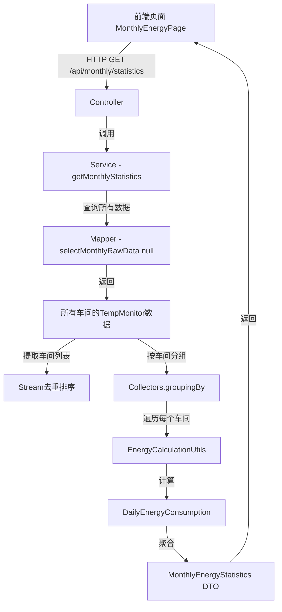

# Design Document

## Overview

月度能耗动态查询功能是一个**全新实现**的功能模块，用于展示指定月份所有有数据车间的每日能耗统计。核心特点是**动态识别车间**，通过一次SQL查询获取该月所有车间的原始数据，然后在代码中提取车间列表、分组处理、计算能耗。

## Code Reuse Analysis

### Existing Components to Leverage
- **EnergyCalculationUtils**: 复用 `calculateDailyEnergyFromRawData()` 方法进行日能耗计算
- **EnergyTimeConfig**: 复用时间配置（7:00-次日6:59）
- **TempMonitor实体类**: 复用现有实体类
- **前端样式参考**: 参考现有能耗页面的科技蓝主题样式

### Integration Points
- **数据库**: 查询 `RSWS_TempMonitor_Copy` 表
- **API规范**: 遵循现有的RESTful API设计风格
- **前端框架**: 使用 React + TypeScript + Ant Design

## Architecture

采用经典的三层架构，通过**一次性查询+内存分组**实现车间列表的自动识别：



### 核心优势
- ✅ **只需一次数据库查询** - 减少网络往返
- ✅ **内存分组处理** - 高效且灵活
- ✅ **无硬编码** - 自动识别所有车间
- ✅ **易维护** - 新增车间自动生效

## Components and Interfaces

### 后端组件

#### 1. MonthlyEnergyMapper (新建)
**文件**: `back2/src/main/java/com/yupi/springbootinit/mapper/sqlserver/MonthlyEnergyMapper.java`

```java
@Mapper
public interface MonthlyEnergyMapper {
    /**
     * 查询指定时间范围内的原始监控数据
     * @param workshop 车间名称（传null查询所有车间）
     * @param startTime 开始时间
     * @param endTime 结束时间
     * @return 原始数据列表
     */
    List<TempMonitor> selectMonthlyRawData(@Param("workshop") String workshop,
                                           @Param("startTime") Date startTime,
                                           @Param("endTime") Date endTime);
}
```

#### 2. MonthlyEnergyMapper.xml (新建)
**文件**: `back2/src/main/resources/mapper/sqlserver/MonthlyEnergyMapper.xml`

```xml
<mapper namespace="com.yupi.springbootinit.mapper.sqlserver.MonthlyEnergyMapper">
    <resultMap id="TempMonitorResultMap" type="com.yupi.springbootinit.model.entity.TempMonitor">
        <id property="id" column="Id"/>
        <result property="deviceId" column="DeviceID"/>
        <result property="name" column="Name"/>
        <result property="tem" column="Tem"/>
        <result property="hum" column="Hum"/>
        <result property="mac" column="MAC"/>
        <result property="updateTime" column="UpdateTime"/>
        <result property="electricEnergy" column="ElectricEnergy"/>
        <result property="nodeId" column="NodeID"/>
        <result property="workshop" column="Workshop"/>
    </resultMap>

    <select id="selectMonthlyRawData" resultMap="TempMonitorResultMap">
        SELECT 
            Id, DeviceID, Name, Tem, Hum, MAC, UpdateTime, ElectricEnergy, NodeID, Workshop
        FROM RSWS_TempMonitor_Copy
        WHERE ElectricEnergy IS NOT NULL
            <if test="workshop != null and workshop != ''">
                AND Workshop = #{workshop}
            </if>
            <if test="startTime != null">
                AND UpdateTime &gt;= #{startTime}
            </if>
            <if test="endTime != null">
                AND UpdateTime &lt;= #{endTime}
            </if>
        ORDER BY Workshop, Name, UpdateTime ASC
    </select>
</mapper>
```

#### 3. MonthlyEnergyStatistics DTO (新建)
**文件**: `back2/src/main/java/com/yupi/springbootinit/model/dto/tempmonitor/MonthlyEnergyStatistics.java`

```java
@Data
public class MonthlyEnergyStatistics implements Serializable {
    private Integer year;                                      // 年份
    private Integer month;                                     // 月份
    private Integer daysInMonth;                               // 该月天数
    private List<String> workshopList;                         // 车间列表（排序后）
    private Map<String, List<Double>> workshopDailyData;       // 各车间每日能耗
    private Map<String, Double> workshopMonthlyTotal;          // 各车间月度总能耗
    private List<Double> dailyTotal;                           // 每日总能耗
    private Double monthlyTotal;                               // 月度总能耗
    
    private static final long serialVersionUID = 1L;
}
```

#### 4. MonthlyEnergyService (新建)
**文件**: `back2/src/main/java/com/yupi/springbootinit/service/MonthlyEnergyService.java`

```java
public interface MonthlyEnergyService {
    /**
     * 获取月度能耗统计数据
     * @param year 年份
     * @param month 月份
     * @return 月度统计数据
     */
    MonthlyEnergyStatistics getMonthlyStatistics(Integer year, Integer month);
}
```

#### 5. MonthlyEnergyServiceImpl (新建)
**文件**: `back2/src/main/java/com/yupi/springbootinit/service/impl/MonthlyEnergyServiceImpl.java`

核心逻辑：
```java
@Service
@Slf4j
public class MonthlyEnergyServiceImpl implements MonthlyEnergyService {

    @Resource
    private MonthlyEnergyMapper monthlyEnergyMapper;

    @Override
    public MonthlyEnergyStatistics getMonthlyStatistics(Integer year, Integer month) {
        // 1. 计算时间范围（使用EnergyTimeConfig）
        Date monthStart = calculateMonthStart(year, month);
        Date monthEnd = calculateMonthEnd(year, month);
        int daysInMonth = getDaysInMonth(year, month);
        
        // 2. 一次性查询所有车间数据
        List<TempMonitor> allRawData = monthlyEnergyMapper.selectMonthlyRawData(
            null, monthStart, monthEnd);
        
        if (allRawData == null || allRawData.isEmpty()) {
            return createEmptyStatistics(year, month, daysInMonth);
        }
        
        // 3. 提取车间列表并排序
        List<String> workshops = extractAndSortWorkshops(allRawData);
        
        // 4. 按车间分组
        Map<String, List<TempMonitor>> dataByWorkshop = allRawData.stream()
            .collect(Collectors.groupingBy(TempMonitor::getWorkshop));
        
        // 5. 遍历车间计算能耗
        Map<String, List<Double>> workshopDailyData = new LinkedHashMap<>();
        Map<String, Double> workshopMonthlyTotal = new LinkedHashMap<>();
        List<Double> dailyTotal = new ArrayList<>(Collections.nCopies(daysInMonth, 0.0));
        
        for (String workshop : workshops) {
            List<TempMonitor> workshopData = dataByWorkshop.get(workshop);
            
            // 使用 EnergyCalculationUtils 计算日能耗
            List<DailyEnergyConsumption> dailyConsumptions = 
                EnergyCalculationUtils.calculateDailyEnergyFromRawData(
                    workshopData, monthStart, monthEnd, workshop);
            
            // 转换为数组并累加
            processDailyData(dailyConsumptions, workshopDailyData, workshopMonthlyTotal, 
                           dailyTotal, workshop, daysInMonth);
        }
        
        // 6. 组装结果
        return buildStatistics(year, month, daysInMonth, workshops, 
                              workshopDailyData, workshopMonthlyTotal, dailyTotal);
    }
}
```

#### 6. MonthlyEnergyController (新建)
**文件**: `back2/src/main/java/com/yupi/springbootinit/controller/MonthlyEnergyController.java`

```java
@RestController
@RequestMapping("/monthly")
@Slf4j
public class MonthlyEnergyController {

    @Resource
    private MonthlyEnergyService monthlyEnergyService;

    @GetMapping("/statistics")
    public BaseResponse<MonthlyEnergyStatistics> getMonthlyStatistics(
            @RequestParam Integer year,
            @RequestParam Integer month) {
        MonthlyEnergyStatistics statistics = monthlyEnergyService.getMonthlyStatistics(year, month);
        return ResultUtils.success(statistics);
    }
}
```

### 前端组件

#### 7. monthlyEnergyController.ts (新建)
**文件**: `front/src/services/SolarBi-front/monthlyEnergyController.ts`

```typescript
import { request } from '@umijs/max';

export async function getMonthlyEnergy(params: {
  year: number;
  month: number;
}) {
  return request<API.BaseResponse<any>>('/api/monthly/statistics', {
    method: 'GET',
    params,
  });
}
```

#### 8. MonthlyEnergyPage (新建)
**文件**: `front/src/pages/MonthlyEnergy/index.tsx`

核心逻辑：
```typescript
const MonthlyEnergyPage: React.FC = () => {
  const [loading, setLoading] = useState(false);
  const [year, setYear] = useState(2025);
  const [month, setMonth] = useState(9);
  const [data, setData] = useState<any>(null);

  // 从后端动态获取车间列表
  const workshops = data?.workshopList || [];

  // 加载数据
  const loadData = async () => {
    const response = await getMonthlyEnergy({ year, month });
    if (response.code === 0) {
      setData(response.data);
    }
  };

  // 高亮判断
  const getHighlightClass = (value: number) => {
    if (value > 4000) return styles.highlightPurple;
    if (value > 2000) return styles.highlightYellow;
    return '';
  };

  // 表格渲染
  return (
    <table>
      <thead>
        <tr>
          <th>信息</th>
          {Array.from({ length: data.daysInMonth }, (_, i) => (
            <th key={i}>{(i + 1).toString().padStart(2, '0')}日</th>
          ))}
        </tr>
      </thead>
      <tbody>
        {workshops.map((workshop) => (
          <tr key={workshop}>
            <td>{workshop}</td>
            {data.workshopDailyData[workshop].map((value, index) => (
              <td key={index} className={getHighlightClass(value)}>
                {formatValue(value)}
              </td>
            ))}
          </tr>
        ))}
      </tbody>
    </table>
  );
};
```

#### 9. index.less (新建)
**文件**: `front/src/pages/MonthlyEnergy/index.less`

科技蓝主题样式，包括：
- 渐变背景
- 固定列滚动
- 高亮样式：
  - 超过2000kWh显示黄色
  - 超过4000kWh显示紫色
- 合计行绿色

## Data Models

### MonthlyEnergyStatistics
```typescript
{
  year: number;                              // 2025
  month: number;                             // 9
  daysInMonth: number;                       // 30
  workshopList: string[];                    // ["101配料", "102造粒", ...]
  workshopDailyData: {                       // {"101配料": [120.5, 130.2, ...]}
    [workshop: string]: number[];
  };
  workshopMonthlyTotal: {                    // {"101配料": 3600.5}
    [workshop: string]: number;
  };
  dailyTotal: number[];                      // [5000.2, 5200.3, ...]
  monthlyTotal: number;                      // 150000.5
}
```

## Implementation Steps

### 后端实现

1. **创建 Mapper 接口和 XML**
   - MonthlyEnergyMapper.java
   - MonthlyEnergyMapper.xml

2. **创建 DTO**
   - MonthlyEnergyStatistics.java

3. **创建 Service 和实现**
   - MonthlyEnergyService.java
   - MonthlyEnergyServiceImpl.java

4. **创建 Controller**
   - MonthlyEnergyController.java

### 前端实现

5. **创建 API 服务**
   - monthlyStatisticsController.ts

6. **创建页面组件**
   - index.tsx
   - index.less

7. **配置路由**
   - routes.ts 中添加 `/monthly-energy` 路由

## Error Handling

1. **该月无车间数据**: 返回空列表，前端显示"暂无数据"
2. **数据库查询失败**: 返回500错误，前端显示错误提示
3. **某车间无有效数据**: 该车间行显示全"-"
4. **网络请求失败**: 前端显示"加载失败，请重试"

## Testing Strategy

- **单元测试**: 测试车间提取、排序、能耗计算
- **集成测试**: 测试完整流程、不同月份、边界条件
- **端到端测试**: 验证表格展示、数据准确性、交互效果
