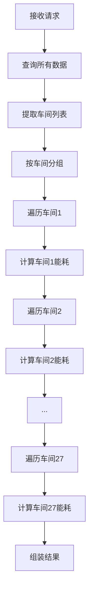
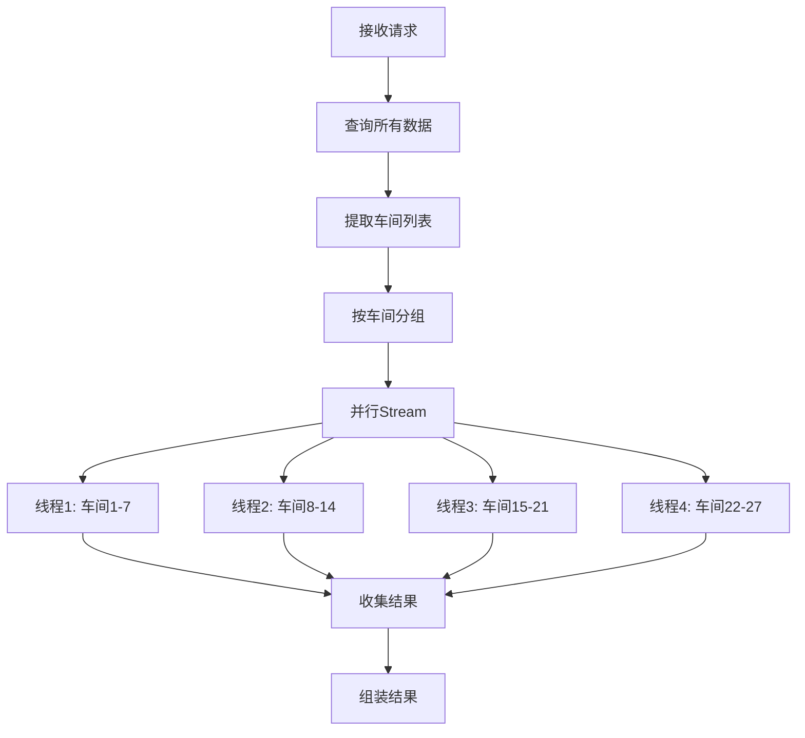

# 设计文档 - 月度能耗统计Service层性能优化

## 概述

本设计聚焦于优化 `MonthlyEnergyServiceImpl` 的计算性能。当前实现中，27个车间的能耗计算是串行执行的，导致总耗时较长。通过引入并行Stream计算和优化数据处理流程，预计可将计算时间从当前的8-10秒降低到2-3秒，性能提升约70%。

## 代码复用分析

### 复用的现有组件
- **EnergyCalculationUtils**: 继续使用其 `calculateDailyEnergyFromRawData()` 方法，无需修改
- **EnergyTimeConfig**: 继续使用时间配置，无需修改
- **MonthlyEnergyMapper**: SQL查询逻辑保持不变
- **ThreadPoolExecutorConfig**: 复用现有的线程池配置

### 集成点
- **MonthlyEnergyServiceImpl**: 主要修改点，引入并行计算
- **日志系统**: 使用Slf4j记录性能指标

## 架构设计

### 优化前的流程（串行）

**总耗时** = 查询时间 + (计算时间 × 27)

### 优化后的流程（并行）

**总耗时** = 查询时间 + (计算时间 × 27 / 线程数)

## 组件和接口

### MonthlyEnergyServiceImpl（优化）

#### 修改方法
```java
@Override
public MonthlyEnergyStatistics getMonthlyStatistics(Integer year, Integer month) {
    long startTime = System.currentTimeMillis();
    
    // 1-2. 查询数据（不变）
    List<TempMonitor> allRawData = monthlyEnergyMapper.selectMonthlyRawData(...);
    long queryTime = System.currentTimeMillis() - startTime;
    log.info("数据查询耗时: {} ms", queryTime);
    
    // 3-4. 提取车间和分组（不变）
    Map<String, List<TempMonitor>> dataByWorkshop = ...;
    
    // 🔥 5. 并行计算每个车间的能耗
    long calcStart = System.currentTimeMillis();
    
    // 使用parallelStream并行处理
    Map<String, WorkshopResult> results = workshops.parallelStream()
        .collect(Collectors.toConcurrentMap(
            workshop -> workshop,
            workshop -> calculateWorkshopEnergy(workshop, dataByWorkshop.get(workshop), ...)
        ));
    
    long calcTime = System.currentTimeMillis() - calcStart;
    log.info("并行计算耗时: {} ms（平均每车间: {} ms）", calcTime, calcTime / workshops.size());
    
    // 6. 组装结果（优化后）
    return assembleStatistics(results, ...);
}

// 🔥 新增：单个车间能耗计算
private WorkshopResult calculateWorkshopEnergy(
        String workshop, 
        List<TempMonitor> workshopData, 
        Date monthStart, 
        Date monthEnd, 
        int daysInMonth) {
    
    if (workshopData == null || workshopData.isEmpty()) {
        return WorkshopResult.empty(daysInMonth);
    }
    
    List<DailyEnergyConsumption> dailyConsumptions = 
        EnergyCalculationUtils.calculateDailyEnergyFromRawData(...);
    
    return WorkshopResult.fromDailyConsumptions(dailyConsumptions, daysInMonth);
}

// 🔥 新增：工作坊计算结果内部类
private static class WorkshopResult {
    List<Double> dailyData;
    double monthlyTotal;
    
    static WorkshopResult empty(int days) {
        return new WorkshopResult(
            new ArrayList<>(Collections.nCopies(days, 0.0)), 
            0.0
        );
    }
    
    static WorkshopResult fromDailyConsumptions(...) {
        // 转换逻辑
    }
}
```

## 关键优化点

### 1. 并行Stream计算
```java
// 优化前：串行遍历
for (String workshop : workshops) {
    List<TempMonitor> workshopData = dataByWorkshop.get(workshop);
    // 计算能耗...
}

// 优化后：并行处理
workshops.parallelStream()
    .forEach(workshop -> {
        List<TempMonitor> workshopData = dataByWorkshop.get(workshop);
        // 计算能耗...（多线程并发执行）
    });
```

### 2. 使用ConcurrentHashMap
```java
// 优化前：LinkedHashMap（线程不安全）
Map<String, List<Double>> workshopDailyData = new LinkedHashMap<>();

// 优化后：ConcurrentHashMap（线程安全）
Map<String, List<Double>> workshopDailyData = new ConcurrentHashMap<>();
```

### 3. 提取计算方法
将车间计算逻辑提取为独立方法，便于并行调用和测试。

### 4. 性能日志
在关键节点记录耗时：
- 数据查询耗时
- 数据分组耗时
- 并行计算总耗时
- 每车间平均耗时
- 结果组装耗时

## 数据模型

### WorkshopResult（新增内部类）
```java
private static class WorkshopResult {
    private List<Double> dailyData;     // 每日能耗数组
    private double monthlyTotal;         // 月度总能耗
    
    // 工厂方法
    static WorkshopResult empty(int daysInMonth);
    static WorkshopResult fromDailyConsumptions(...);
}
```

## 错误处理

### 并行计算异常
1. **某个车间计算失败**
   - 处理：捕获异常，记录日志，使用空数据代替
   - 用户影响：该车间显示为0或"-"，其他车间正常

2. **线程池饱和**
   - 处理：使用ForkJoinPool的默认策略
   - 用户影响：自动降级为部分并行

## 测试策略

### 性能测试
- 对比优化前后的执行时间
- 测试不同数据量下的性能表现
- 验证并行度与性能提升的关系

### 功能测试
- 验证并行计算结果与串行一致
- 测试异常场景处理
- 验证日志输出正确性


