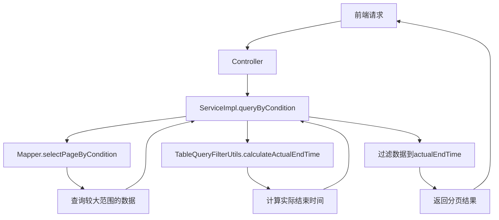

# Design Document

## Overview

本设计方案通过创建新的工具类 `TableQueryFilterUtils`，实现表格查询的动态结束时间计算逻辑。该工具类将被各车间的 ServiceImpl 调用，以统一表格数据查询的时间范围，确保与能耗计算使用相同的时间边界。

## Steering Document Alignment

### Technical Standards
- 遵循现有的工具类设计模式（参考 EnergyCalculationUtils）
- 保持代码的可复用性和可维护性
- Service 接口保持不变，只修改实现层

### Project Structure
- 工具类位于 `back2/src/main/java/com/yupi/springbootinit/utils/`
- Service 实现位于 `back2/src/main/java/com/yupi/springbootinit/service/impl/`
- 不修改 Controller 层和 Mapper 层

## Code Reuse Analysis

### Existing Components to Leverage
- **Calendar API**: Java 内置的时间处理工具
- **现有的 Service 架构**: 保持现有的 queryByCondition 方法签名
- **TempMonitor 实体**: 复用现有的数据模型
- **分页机制**: 使用 MyBatis-Plus 的 Page 对象

### Integration Points
- **ServiceImpl**: 各车间的 ServiceImpl 将调用新工具类
- **Mapper 查询**: 保持现有的 Mapper 查询逻辑不变

## Architecture

### 整体架构



### Modular Design Principles
- **Single File Responsibility**: TableQueryFilterUtils 专门负责时间计算和过滤逻辑
- **Component Isolation**: 工具类独立，不依赖具体的 Service 实现
- **Service Layer Separation**: Service 层只负责调用和组合逻辑
- **Utility Modularity**: 工具方法可被所有车间的 ServiceImpl 复用

## Components and Interfaces

### Component 1: TableQueryFilterUtils (新建)

- **Purpose:** 提供表格查询的时间过滤和计算工具方法
- **Location:** `back2/src/main/java/com/yupi/springbootinit/utils/TableQueryFilterUtils.java`
- **Interfaces:** 
  ```java
  public class TableQueryFilterUtils {
      /**
       * 计算实际结束时间
       * @param rawData 原始数据列表
       * @param endTime 用户输入的结束时间
       * @return 实际结束时间（所有设备在截取后时间之后最近记录中的最晚时间）
       */
      public static Date calculateActualEndTime(List<TempMonitor> rawData, Date endTime);
      
      /**
       * 将时间截取到小时开始
       * @param time 原始时间
       * @return 截取后的时间
       */
      private static Date truncateToHour(Date time);
  }
  ```

- **Dependencies:** 
  - Java Calendar API
  - TempMonitor 实体类

- **详细实现逻辑:**
  1. 将 endTime 截取到小时开始（例如 11:59:00 → 11:00:00）
  2. 按设备名称（Name）对数据进行分组
  3. 对每个设备，查找截取后时间之后最近的一条记录
  4. 收集所有设备的这些时间
  5. 返回其中最晚的时间作为 actualEndTime
  6. 如果没有找到任何记录，返回原始的 endTime

### Component 2: ServiceImpl.queryByCondition (修改)

- **Purpose:** 表格数据查询方法，调用工具类计算实际结束时间
- **Location:** 各车间的 ServiceImpl（如 OfficeArea114ServiceImpl.java）
- **修改逻辑:**
  ```java
  @Override
  public Page<TempMonitor> queryByCondition(TempMonitorQueryRequest request) {
      // 1. 扩大查询范围（查询更大的时间范围以获取足够数据）
      Date expandedEndTime = expandEndTime(request.getEndTime());
      
      // 2. 查询原始数据
      Page<TempMonitor> rawPage = officearea114Mapper.selectPageByCondition(
          page,
          request.getDeviceId(),
          request.getName(),
          fixedWorkshop,
          request.getStartTime(),
          expandedEndTime,  // 使用扩大的结束时间
          request.getSortField(),
          request.getSortOrder()
      );
      
      // 3. 调用工具类计算实际结束时间
      Date actualEndTime = TableQueryFilterUtils.calculateActualEndTime(
          rawPage.getRecords(), 
          request.getEndTime()
      );
      
      // 4. 过滤数据到actualEndTime
      List<TempMonitor> filteredRecords = rawPage.getRecords().stream()
          .filter(record -> record.getUpdateTime().compareTo(actualEndTime) <= 0)
          .collect(Collectors.toList());
      
      // 5. 构建新的分页结果
      Page<TempMonitor> result = new Page<>(request.getCurrent(), request.getPageSize());
      result.setRecords(filteredRecords);
      result.setTotal(filteredRecords.size());
      
      return result;
  }
  
  private Date expandEndTime(Date endTime) {
      Calendar cal = Calendar.getInstance();
      cal.setTime(endTime);
      cal.add(Calendar.HOUR_OF_DAY, 2);  // 扩大2小时以确保能查到数据
      return cal.getTime();
  }
  ```

- **Dependencies:** 
  - TableQueryFilterUtils
  - 现有的 Mapper

- **Reuses:** 
  - 现有的 Mapper 查询方法
  - 现有的分页机制

## Data Models

### 输入数据
```java
TempMonitorQueryRequest {
    startTime: Date       // 开始时间（如 08:00:00）
    endTime: Date         // 结束时间（如 11:59:00）
    deviceId: String      // 设备ID（可选）
    name: String          // 设备名称（可选）
    sortField: String     // 排序字段
    sortOrder: String     // 排序方向
    current: Long         // 当前页
    pageSize: Long        // 每页大小
}
```

### 输出数据
```java
Page<TempMonitor> {
    records: List<TempMonitor>  // 过滤后的记录列表
    total: Long                 // 总记录数
    current: Long               // 当前页
    size: Long                  // 每页大小
}
```

### 中间数据
```java
// calculateActualEndTime 方法内部使用
Map<String, List<TempMonitor>> deviceDataMap  // 按设备分组的数据
List<Date> deviceEndTimes                     // 每个设备的结束时间列表
Date actualEndTime                            // 计算出的实际结束时间
```

## Error Handling

### Error Scenarios

1. **Scenario: endTime 之后没有任何数据**
   - **Handling:** 返回原始的 endTime 作为 actualEndTime
   - **User Impact:** 表格返回 startTime 到 endTime 的数据（原始行为）

2. **Scenario: rawData 为空或 null**
   - **Handling:** 返回原始的 endTime
   - **User Impact:** 无影响，正常返回空结果

3. **Scenario: 某个设备没有截取后时间之后的数据**
   - **Handling:** 跳过该设备，只使用有数据的设备计算
   - **User Impact:** 使用其他设备的时间计算 actualEndTime

4. **Scenario: 时间计算异常**
   - **Handling:** 捕获异常，记录日志，返回原始 endTime
   - **User Impact:** 降级到原始查询逻辑

## Testing Strategy

### Unit Testing

**测试 TableQueryFilterUtils.calculateActualEndTime:**
1. 正常情况：多个设备，返回最晚时间
   - 输入：3个设备，endTime = 11:59:00
   - 设备时间：11:05:00, 11:03:00, 11:10:00
   - 预期：11:10:00

2. 边界情况：只有一个设备
   - 输入：1个设备，endTime = 11:59:00
   - 设备时间：11:05:00
   - 预期：11:05:00

3. 异常情况：没有设备在截取后时间之后有数据
   - 输入：所有设备最后记录都在 11:00:00 之前
   - 预期：返回原始 endTime

4. 时间截取测试：
   - 输入：11:59:59
   - 预期截取后：11:00:00

### Integration Testing

**测试 ServiceImpl.queryByCondition:**
1. 完整流程测试：
   - 输入：08:00:00 - 11:59:00
   - 验证：返回的数据最晚时间 ≤ actualEndTime
   - 验证：actualEndTime 基于设备最晚时间计算

2. 分页测试：
   - 验证：过滤后的分页功能正常
   - 验证：total 数量正确

### End-to-End Testing

**前端到后端完整测试:**
1. 前端请求表格数据（08:00-11:59）
2. 验证返回数据的时间范围正确
3. 验证数据条数与能耗计算一致

## Implementation Checklist

- [ ] 创建 TableQueryFilterUtils 工具类
- [ ] 实现 calculateActualEndTime 方法
- [ ] 实现 truncateToHour 辅助方法
- [ ] 修改 OfficeArea114ServiceImpl（示例）
- [ ] 添加单元测试
- [ ] 验证功能正确性
- [ ] 应用到其他车间的 ServiceImpl
