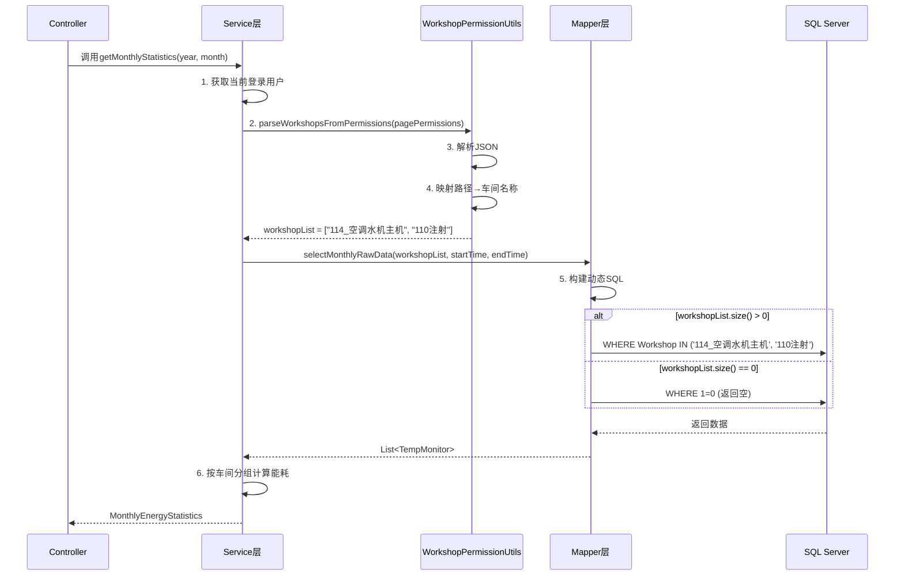

# Design Document

## Overview

本设计实现基于用户 `pagePermissions` 字段的车间数据过滤功能，应用于月度能耗统计和日能耗统计两个API。通过在Service层解析用户权限并在Mapper层使用动态SQL过滤，实现数据级访问控制。

**核心设计理念**：
- 所有用户（包括管理员）都严格按照 `pagePermissions` 字段进行过滤
- 创建工具类封装权限解析逻辑，供多个Service复用
- 在Service层调用工具类生成车间名称列表
- 将车间列表传递给Mapper层
- 在SQL层面使用 `IN` 子句过滤数据，提高查询效率

## Steering Document Alignment

### Technical Standards (tech.md)

根据 `structure.md` 中的技术栈：
- **后端框架**: Spring Boot 2.7.2 + MyBatis-Plus 3.5.2
- **数据库**: SQL Server (能耗数据)
- **日志**: SLF4J + Lombok `@Slf4j`
- **JSON解析**: Gson（已在项目中使用）

本设计遵循以下技术标准：
- 使用MyBatis动态SQL（`<if>`, `<foreach>`）
- 使用Lombok简化代码
- 使用INFO/WARN级别日志记录关键操作
- 保持现有Service层的代码风格

### Project Structure (structure.md)

**改动文件位置**：
```
back2/src/main/java/com/yupi/springbootinit/
├── utils/
│   └── WorkshopPermissionUtils.java     ➕ 新建（工具类）
├── service/impl/
│   ├── MonthlyEnergyServiceImpl.java    ✏️ 修改
│   └── HourlyEnergyServiceImpl.java     ✏️ 修改
├── mapper/sqlserver/
│   ├── MonthlyEnergyMapper.java         ✏️ 修改
│   └── HourlyEnergyMapper.java          ✏️ 修改

back2/src/main/resources/mapper/sqlserver/
├── MonthlyEnergyMapper.xml              ✏️ 修改
└── HourlyEnergyMapper.xml               ✏️ 修改
```

**总计**: 7个文件（1个新建，6个修改）

## Code Reuse Analysis

### Existing Components to Leverage

- **`LoginUserVO`**: 当前登录用户对象，包含 `pagePermissions` 字段
- **`EnergyCalculationUtils`**: 能耗计算工具类，无需修改，继续复用
- **`WORKSHOP_ORDER`**: 两个Service类中已定义的车间顺序常量，可作为映射基础

### Integration Points

- **用户Session**: 从 `request.getSession()` 或Spring Security Context获取当前登录用户
- **Gson**: 使用项目中已有的Gson依赖解析JSON格式的 `pagePermissions`
- **MyBatis动态SQL**: 利用MyBatis的 `<if>` 和 `<foreach>` 标签实现条件查询

## Architecture

### 整体流程



### Modular Design Principles

- **单一职责原则**: 
  - 工具类负责权限解析
  - Service层负责业务逻辑
  - Mapper层只负责数据查询
- **代码复用**: 工具类供多个Service共享，避免代码重复
- **向后兼容**: API响应结构不变，只改变返回的车间数量

## Components and Interfaces

### Component 1: WorkshopPermissionUtils (工具类 - 新建)

**Purpose**: 封装权限解析逻辑，提供静态方法供Service层调用

**文件路径**: `back2/src/main/java/com/yupi/springbootinit/utils/WorkshopPermissionUtils.java`

**完整实现**:
```java
package com.yupi.springbootinit.utils;

import com.google.gson.Gson;
import lombok.extern.slf4j.Slf4j;

import java.util.ArrayList;
import java.util.HashMap;
import java.util.List;
import java.util.Map;

/**
 * 车间权限工具类
 * 用于解析用户的pagePermissions字段并映射为车间名称列表
 */
@Slf4j
public class WorkshopPermissionUtils {

    /**
     * 页面路径到车间名称的映射表（静态缓存）
     */
    private static final Map<String, String> PATH_TO_WORKSHOP_MAPPING = buildPathToWorkshopMapping();

    /**
     * 从pagePermissions解析用户有权访问的车间列表
     * 
     * @param pagePermissions JSON格式的页面权限字符串，如 ["\/airConditioning", "\/injection-110"]
     * @return 车间名称列表，如果解析失败返回空列表
     */
    public static List<String> parseWorkshopsFromPermissions(String pagePermissions) {
        List<String> allowedWorkshops = new ArrayList<>();
        
        // 空权限处理
        if (pagePermissions == null || pagePermissions.trim().isEmpty() || "[]".equals(pagePermissions)) {
            log.warn("pagePermissions为空，将返回空车间列表");
            return allowedWorkshops;
        }
        
        try {
            // 使用Gson解析JSON数组
            Gson gson = new Gson();
            String[] paths = gson.fromJson(pagePermissions, String[].class);
            
            // 映射路径到车间名称
            for (String path : paths) {
                if (PATH_TO_WORKSHOP_MAPPING.containsKey(path)) {
                    allowedWorkshops.add(PATH_TO_WORKSHOP_MAPPING.get(path));
                } else {
                    log.debug("忽略未映射的路径: {}", path);
                }
            }
            
            log.info("解析到{}个有权访问的车间: {}", allowedWorkshops.size(), allowedWorkshops);
            
        } catch (Exception e) {
            log.warn("解析pagePermissions失败: {}, 将返回空车间列表", e.getMessage());
        }
        
        return allowedWorkshops;
    }

    /**
     * 构建页面路径到车间名称的映射表
     * 
     * @return 映射表
     */
    private static Map<String, String> buildPathToWorkshopMapping() {
        Map<String, String> mapping = new HashMap<>();
        
        // 27个车间的路径映射
        mapping.put("/airConditioning", "114_空调水机主机");
        mapping.put("/injection_workshop", "110注射环保设备");
        mapping.put("/granulation_workshop", "102造粒环保设备");
        mapping.put("/office_building", "1#办公楼");
        mapping.put("/feeding_workshop", "101配料");
        mapping.put("/granule102", "102造粒");
        mapping.put("/cold-press-103", "103冷压");
        mapping.put("/restoration-104", "104还原");
        mapping.put("/sintering-105", "105烧结");
        mapping.put("/cleaning-106", "106清洗");
        mapping.put("/beading-107", "107串珠");
        mapping.put("/rubber-109", "109炼胶");
        mapping.put("/injection-110", "110注射");
        mapping.put("/edging-111", "111开刃");
        mapping.put("/final-inspection-112", "112终检");
        mapping.put("/warehouse-113", "113仓库");
        mapping.put("/elevator-114", "114_2#厂房电梯");
        mapping.put("/office-area-114", "114_2#楼办公区域");
        mapping.put("/conference-room-114", "114_2#楼会议室");
        mapping.put("/laboratory-114", "114_2#楼实验室");
        mapping.put("/public-114", "114公共");
        mapping.put("/air-compressor-114", "114空压机");
        mapping.put("/charging-pile", "充电桩");
        mapping.put("/tool-rd-center", "工具研发中心");
        mapping.put("/guard-room", "门卫室");
        mapping.put("/canteen", "食堂");
        mapping.put("/dormitory", "宿舍楼");
        
        return mapping;
    }
}
```

**核心方法**:
- `parseWorkshopsFromPermissions(String pagePermissions)`: 解析权限并返回车间列表
- `buildPathToWorkshopMapping()`: 构建映射表（私有静态方法）

**特性**:
- 使用静态常量缓存映射表，避免重复创建
- 使用 `@Slf4j` 记录日志
- 异常安全，解析失败返回空列表而非抛出异常
- 代码整洁，只保留必要的方法

---

### Component 2: MonthlyEnergyServiceImpl (Service层 - 修改)

**Purpose**: 调用工具类解析用户权限，生成车间列表，调用Mapper查询数据

**新增逻辑**:
```java
// 1. 获取当前登录用户
User currentUser = userService.getLoginUser(request);

// 2. 调用工具类解析pagePermissions，生成车间列表
List<String> allowedWorkshops = WorkshopPermissionUtils.parseWorkshopsFromPermissions(
    currentUser.getPagePermissions());

// 3. 调用Mapper（传入车间列表）
List<TempMonitor> allRawData = monthlyEnergyMapper.selectMonthlyRawData(
    allowedWorkshops, monthStart, monthEnd);
```

**Dependencies**: 
- `UserService` (获取当前登录用户)
- `WorkshopPermissionUtils` (权限解析工具类)
- `MonthlyEnergyMapper` (数据查询)

**变更说明**:
- 移除原Service中的权限解析逻辑
- 调用工具类的静态方法

---

### Component 3: HourlyEnergyServiceImpl (Service层 - 修改)

**Purpose**: 与月度统计相同，调用工具类解析权限并查询日能耗数据

**新增逻辑**: 与 `MonthlyEnergyServiceImpl` 完全一致

**核心代码**:
```java
// 调用工具类解析权限
List<String> allowedWorkshops = WorkshopPermissionUtils.parseWorkshopsFromPermissions(
    currentUser.getPagePermissions());

// 调用Mapper查询
List<TempMonitor> allRawData = hourlyEnergyMapper.selectAllWorkshopsHourlyData(
    allowedWorkshops, startTime, endTime);
```

---

### Component 4: MonthlyEnergyMapper (Mapper接口层 - 修改)

**Purpose**: 定义查询方法签名

**修改前**:
```java
List<TempMonitor> selectMonthlyRawData(@Param("workshop") String workshop,
                                       @Param("startTime") Date startTime,
                                       @Param("endTime") Date endTime);
```

**修改后**:
```java
List<TempMonitor> selectMonthlyRawData(@Param("workshopList") List<String> workshopList,
                                       @Param("startTime") Date startTime,
                                       @Param("endTime") Date endTime);
```

**变更说明**: 
- 移除 `workshop` 单个车间参数
- 新增 `workshopList` 车间列表参数

---

### Component 5: MonthlyEnergyMapper.xml (Mapper SQL层 - 修改)

**Purpose**: 使用动态SQL根据车间列表过滤数据

**修改后的SQL**:
```xml
<select id="selectMonthlyRawData" resultMap="TempMonitorResultMap">
    SELECT 
        Id, DeviceID, Name, Tem, Hum, MAC,
        UpdateTime, ElectricEnergy, NodeID, Workshop
    FROM RSWS_TempMonitor_Copy
    WHERE ElectricEnergy IS NOT NULL
      AND Workshop != '备用'
      AND Workshop != '备用总表'
      <if test="workshopList != null and workshopList.size() > 0">
          AND Workshop IN
          <foreach collection="workshopList" item="workshop" 
                   open="(" separator="," close=")">
              #{workshop}
          </foreach>
      </if>
      <if test="workshopList != null and workshopList.size() == 0">
          AND 1=0
      </if>
      <if test="startTime != null">
          AND UpdateTime &gt;= #{startTime}
      </if>
      <if test="endTime != null">
          AND UpdateTime &lt;= #{endTime}
      </if>
    ORDER BY Workshop, Name, UpdateTime ASC
</select>
```

**动态SQL逻辑**:
- `workshopList.size() > 0`: 使用 `IN` 子句过滤指定车间
- `workshopList.size() == 0`: 使用 `WHERE 1=0` 返回空结果

---

### Component 6 & 7: HourlyEnergyMapper & HourlyEnergyMapper.xml (修改)

**Purpose**: 与月度Mapper完全一致的修改

**接口修改**:
```java
List<TempMonitor> selectAllWorkshopsHourlyData(
    @Param("workshopList") List<String> workshopList,
    @Param("startTime") Date startTime,
    @Param("endTime") Date endTime);
```

**XML修改**: 与 `MonthlyEnergyMapper.xml` 相同的动态SQL逻辑

## Data Models

### 输入数据模型

**User实体 (已存在)**:
```java
public class User {
    private Long id;
    private String userAccount;
    private String userRole;          // "admin" 或 "user"
    private String pagePermissions;   // JSON格式: ["\/airConditioning", "\/injection-110"]
    // ... 其他字段
}
```

**pagePermissions格式**:
```json
[
  "/monthly-energy",
  "/hourly-energy",
  "/airConditioning",
  "/injection-110",
  "/granule102"
]
```

**如果管理员需要查看所有27个车间，需要在pagePermissions中配置所有27个车间路径。**

### 映射配置数据模型

**路径到车间名称的映射表** (在WorkshopPermissionUtils中定义):

共27个映射关系（详见Component 1的完整代码）

### 输出数据模型

**MonthlyEnergyStatistics (无变更)**:
```java
{
  "year": 2025,
  "month": 10,
  "daysInMonth": 31,
  "workshopList": ["114_空调水机主机", "110注射"],
  "workshopDailyData": {
    "114_空调水机主机": [120.5, 135.2, ...],
    "110注射": [200.1, 215.3, ...]
  },
  "dailyTotal": [320.6, 350.5, ...],
  "workshopMonthlyTotal": {
    "114_空调水机主机": 3500.5,
    "110注射": 6200.3
  },
  "monthlyTotal": 9700.8
}
```

## Error Handling

### Error Scenarios

#### 1. pagePermissions解析失败

**场景**: pagePermissions字段包含非法JSON格式

**处理逻辑**: 工具类捕获异常，记录WARN日志，返回空列表

**用户影响**: API正常返回，但 `workshopList` 为空数组

#### 2. 用户无任何车间权限

**场景**: pagePermissions为空或只包含非车间页面

**处理逻辑**:
- 工具类返回空车间列表 `[]`
- Mapper使用 `WHERE 1=0` 返回空结果

**用户影响**: 前端显示"暂无数据"

#### 3. 获取当前用户失败

**场景**: 用户未登录或Session过期

**处理逻辑**:
```java
User currentUser = userService.getLoginUser(request);
if (currentUser == null) {
    throw new BusinessException(ErrorCode.NOT_LOGIN_ERROR);
}
```

**用户影响**: API返回401错误，前端跳转到登录页

## Testing Strategy

### Unit Testing

**测试工具类的权限解析逻辑**:

```java
public class WorkshopPermissionUtilsTest {
    
    @Test
    public void testParseWorkshopsFromPermissions_ValidJson() {
        String permissions = "[\"/airConditioning\", \"/injection-110\"]";
        List<String> result = WorkshopPermissionUtils.parseWorkshopsFromPermissions(permissions);
        
        assertEquals(2, result.size());
        assertTrue(result.contains("114_空调水机主机"));
        assertTrue(result.contains("110注射"));
    }

    @Test
    public void testParseWorkshopsFromPermissions_EmptyJson() {
        String permissions = "[]";
        List<String> result = WorkshopPermissionUtils.parseWorkshopsFromPermissions(permissions);
        
        assertEquals(0, result.size());
    }

    @Test
    public void testParseWorkshopsFromPermissions_InvalidJson() {
        String permissions = "invalid json";
        List<String> result = WorkshopPermissionUtils.parseWorkshopsFromPermissions(permissions);
        
        assertEquals(0, result.size());
    }

    @Test
    public void testParseWorkshopsFromPermissions_NullPermissions() {
        List<String> result = WorkshopPermissionUtils.parseWorkshopsFromPermissions(null);
        
        assertEquals(0, result.size());
    }
}
```

### Integration Testing

**测试Mapper层的动态SQL**:

```java
@SpringBootTest
public class MonthlyEnergyMapperTest {
    
    @Resource
    private MonthlyEnergyMapper mapper;
    
    @Test
    public void testSelectWithWorkshopList() {
        List<String> workshops = Arrays.asList("114_空调水机主机", "110注射");
        List<TempMonitor> result = mapper.selectMonthlyRawData(
            workshops, startTime, endTime);
        
        Set<String> returnedWorkshops = result.stream()
            .map(TempMonitor::getWorkshop)
            .collect(Collectors.toSet());
        assertTrue(returnedWorkshops.size() <= 2);
    }
    
    @Test
    public void testSelectWithEmptyWorkshopList() {
        List<String> workshops = new ArrayList<>();
        List<TempMonitor> result = mapper.selectMonthlyRawData(
            workshops, startTime, endTime);
        
        assertEquals(0, result.size());
    }
}
```

### End-to-End Testing

1. **用户有权限测试**: 验证返回正确的车间数据
2. **用户无权限测试**: 验证返回空数据
3. **管理员全权限测试**: 验证返回所有27个车间数据
4. **异常情况测试**: 验证pagePermissions非法时不抛出异常

## Performance Considerations

### 优化点

1. **SQL层面过滤**: 使用 `WHERE Workshop IN (...)` 直接在数据库过滤
2. **映射表缓存**: 使用静态常量 `PATH_TO_WORKSHOP_MAPPING`，避免重复创建
3. **工具类静态方法**: 无需实例化，直接调用

### 性能指标

- **权限解析耗时**: < 10ms
- **SQL过滤耗时**: 与现有查询时间相同
- **总体响应时间增加**: < 50ms

## Security Considerations

1. **SQL注入防护**: 使用MyBatis参数绑定 `#{workshop}`
2. **权限逃逸防护**: 在工具类和SQL层双重过滤
3. **日志脱敏**: 只记录用户ID和车间列表

## Migration and Rollback Plan

### 迁移步骤

1. **阶段1**: 创建工具类 `WorkshopPermissionUtils`
2. **阶段2**: 修改Mapper接口和XML
3. **阶段3**: 修改Service实现类
4. **阶段4**: 测试验证
5. **阶段5**: 上线部署

### 回滚方案

如需回滚，删除工具类并恢复6个文件到修改前的版本即可。
